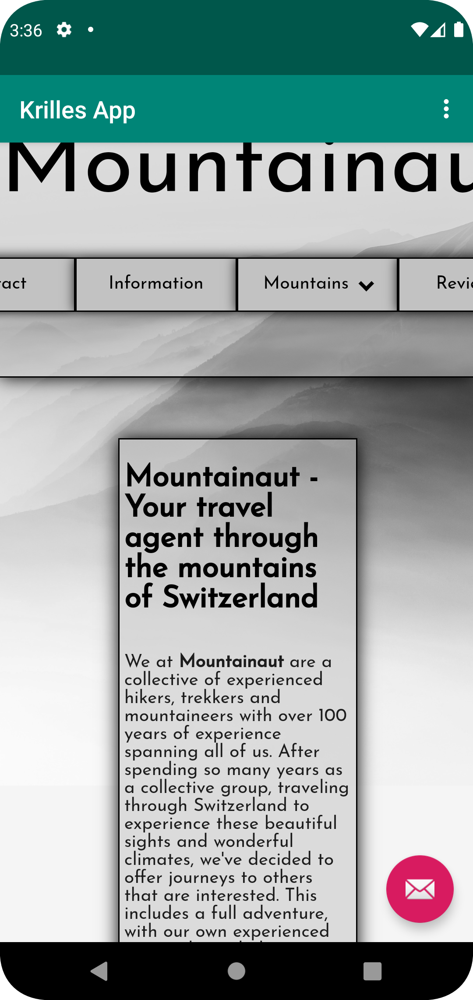
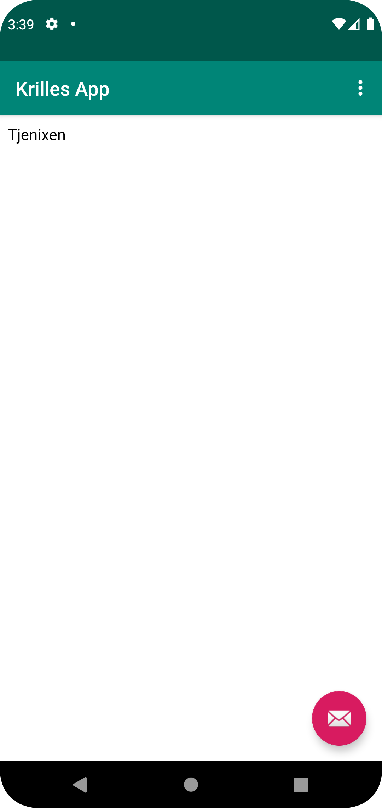

- Först så namngav jag applikationen genom att skapa stringen i "strings.xml" och hänvisade till denna i "AndroidManifest.xml" som följande
```
<string name="app_name">Krilles App</string>

<application
    android:allowBackup="true"
    android:icon="@mipmap/ic_launcher"
    android:label="@string/app_name"
    android:roundIcon="@mipmap/ic_launcher_round"
    android:supportsRtl="true"
    android:theme="@style/AppTheme">
```
Alltså hänvisade till denna inom "android:label".


- Sedan så gav jag applikationen rättigheterna till att använda internet genom följande linje kod i "AndroidManifest.xml"
```
    <uses-permission android:name="android.permission.INTERNET"/>
```

- Sedan så ersatte jag den dåvarande TextView till en WebView med tillhörande attribut med sitt egna ID
```
    <WebView
        android:id="@+id/myWebView"
        android:layout_height="match_parent"
        android:layout_width="match_parent" />
```

- Sedan så skapade jag variabeln för denna i "MainActivity.java" samt initierade denna inom "onCreate" genom att tilldela den till den skapade variabeln genom "myWebView = findViewById(R.id.myWebView)"

```
public class MainActivity extends AppCompatActivity {

    WebView myWebView;
```

```
 protected void onCreate(Bundle savedInstanceState) {
        super.onCreate(savedInstanceState);
        setContentView(R.layout.activity_main);
        Toolbar toolbar = findViewById(R.id.toolbar);
        setSupportActionBar(toolbar);

        myWebView = findViewById(R.id.myWebView);
 ```

 - Sedan gav jag denna applikation rättigheter till att använda sig av JavaScript samt skapade den WebView som kommer att presenteras

 ```
         myWebView.getSettings().setJavaScriptEnabled(true);
         myWebView.setWebViewClient(new WebViewClient());
 ```

 - Sedan så skapade jag en html-fil med namnet "index.html" som lades inom den nyskapade mappen "assets", denna fil blev den interna webbsidan som sedan kommer att visas upp inom mappen, denna fil fick denna styling:

 ```
 <html>
 <body>
 <main>
     <h1>Hallåjsan</h1>
     <p>Tjenixen</p>
 </main>
 </body>
 </html>
 ```

 - Sedan så implementerade jag "loadUrl" för dom två olika hemsidorna under funktionerna "showExternalWebPage" samt "showInternalWebPage"

 ```
     public void showExternalWebPage(){
         myWebView.loadUrl("https://wwwlab.iit.his.se/e21krida/Webbplats-Dugga/");
     }

     public void showInternalWebPage(){
         myWebView.loadUrl("file:///android_asset/index.html");
     }
 ```

 - Slutligen så måste jag kalla på dessa funktioner inom dom knappar som återfinns inom applikationen, detta genom att kalla på dom inom if-satsen för "onOptionsItemSelected" som har valen "action_external_web" samt "action_internal_web"

 ```
     @Override
     public boolean onOptionsItemSelected(MenuItem item) {
         // Handle action bar item clicks here. The action bar will
         // automatically handle clicks on the Home/Up button, so long
         // as you specify a parent activity in AndroidManifest.xml.
         int id = item.getItemId();

         //noinspection SimplifiableIfStatement
         if (id == R.id.action_external_web) {
             showExternalWebPage();
             return true;
         }

         if (id == R.id.action_internal_web) {
             showInternalWebPage();
             return true;
         }
 ```

 - Dessa är bilder på applikationen, varav första bilden är för den externa och den andra för den interna.

 ;

 ;

